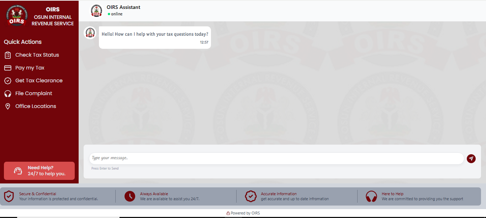
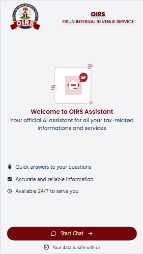
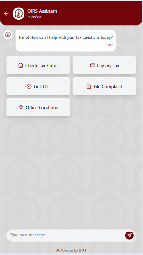

# 🧠 OIRS AI Chatbot

An AI-powered assistant for the Osun Internal Revenue Service (OIRS) designed to help users with tax-related inquiries, payments, compliance guidance, and general support.

---

🔗 Live Demo: https://komabox.netlify.app/

---

## 🚀 Features

- AI-powered tax assistance using Google Gemini
- Context-aware responses using knowledge base (RAG-style)
- Quick action prompts for common user queries
- Mobile & desktop responsive UI
- Real-time chat experience
- Bot typing indicators
- Secure backend-controlled AI logic
- Semantic search support (embeddings-ready architecture)

---

## 🏗️ Tech Stack

### Frontend
- React.js
- Tailwind CSS
- Framer Motion
- React Router

### Backend
- Node.js
- Express.js
- Google Gemini API (@google/genai)
- Semantic search (embeddings layer optional)

---

## 🔐 Security Architecture

This project follows strict server-side AI control principles:

- No frontend-controlled AI instructions
- No frontend history injection
- No client-side prompt engineering
- All system prompts defined on server
- Knowledge base injected server-side only
- AI responses fully controlled by backend logic

---

## 💬 Chat Flow

1. User sends message from frontend
2. Request goes to `/api/chat`
3. Backend:
   - Retrieves relevant knowledge base entries
   - Applies system rules (OIRS policy)
   - Sends request to Gemini AI
4. AI response is returned to frontend
5. UI updates chat history

---

## ⚡ Quick Actions

Quick actions provide guided prompts for users such as:
- Tax payment help
- Tax clearance certificate (TCC)
- Complaint filing
- Office location lookup

---

## 🧠 Knowledge Base System

The chatbot uses a retrieval-augmented approach:

- User query → semantic search
- Top relevant Q&A retrieved
- Injected into AI context
- AI prioritizes verified responses

---

## 📦 Installation

### Backend
npm run dev

### Frontend
npm run dev

## 🔑 Environment Variables
GEMINI_API_KEY=your_api_key_here
PORT=3000

## 📡 API Endpoint

- POST /api/chat

## 📈 Future Improvements
Redis caching layer for faster responses
Advanced semantic search (vector DB upgrade)
Streaming responses (ChatGPT-style typing)
Admin dashboard for knowledge base updates
Analytics & usage tracking
Rate limiting & abuse protection

## 📷 Screenshots

## 🏛️ Built For
Osun Internal Revenue Service (OIRS)

## 👨‍💻 Developer Notes

This project is designed with production AI safety principles in mind, ensuring all AI responses are controlled, predictable, and compliant with organizational policies.